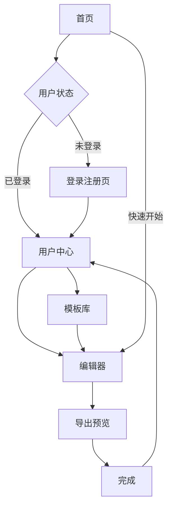

# AI简历生成平台产品需求文档

## 1. 产品概述

一个轻量级、AI驱动的简历生成平台，支持多种文件格式导入导出，提供高度自定义的简历样式和实时编辑功能。用户可以通过简单的操作或Markdown编辑快速创建专业简历，AI能力帮助优化内容并提供个性化建议。

目标用户包括求职者、HR、猎头以及需要频繁更新简历的专业人士。产品价值在于降低简历制作门槛，提升简历质量，节省用户时间。

## 2. 核心功能

### 2.1 用户角色

| 角色 | 注册方式 | 核心权限 |
|------|----------|----------|
| 普通用户 | 邮箱注册/第三方登录 | 创建编辑简历、使用基础模板、导出PDF |
| 高级用户 | 付费升级 | 解锁高级模板、AI深度优化、批量处理 |
| 管理员 | 后台创建 | 管理模板、用户管理、系统配置 |

### 2.2 功能模块

平台包含以下核心页面：

1. **首页**: 产品展示、模板预览、快速开始入口
2. **编辑器页面**: 简历编辑、实时预览、AI辅助面板
3. **模板库页面**: 模板浏览、分类筛选、样式预览
4. **用户中心页面**: 简历管理、个人信息、设置选项
5. **登录注册页面**: 用户认证、第三方登录

### 2.3 页面详情

| 页面名称 | 模块名称 | 功能描述 |
|----------|----------|----------|
| 首页 | Hero展示区 | 展示产品核心价值，包含动态模板轮播 |
| 首页 | 模板预览 | 网格布局展示热门模板，支持hover效果 |
| 首页 | 快速开始 | 提供"从空白开始"和"导入现有"两个入口 |
| 编辑器页面 | 编辑面板 | 左侧Markdown编辑器，支持语法高亮 |
| 编辑器页面 | 实时预览 | 右侧实时渲染简历效果，支持缩放 |
| 编辑器页面 | AI助手 | 底部浮动面板，提供优化建议和自动完成功能 |
| 编辑器页面 | 工具栏 | 包含导出、保存、撤销、重做等操作 |
| 模板库页面 | 分类导航 | 按行业、风格、颜色等维度分类 |
| 模板库页面 | 模板卡片 | 展示模板缩略图、名称、使用次数 |
| 模板库页面 | 筛选器 | 支持多条件组合筛选 |
| 用户中心页面 | 简历列表 | 卡片式展示用户所有简历 |
| 用户中心页面 | 个人信息 | 编辑头像、姓名、联系方式等 |
| 用户中心页面 | 设置选项 | 主题偏好、导出设置、账户管理 |
| 登录注册页面 | 登录表单 | 邮箱密码登录、记住密码 |
| 登录注册页面 | 注册表单 | 邮箱验证、密码强度检测 |
| 登录注册页面 | 第三方登录 | 支持GitHub、Google快捷登录 |

## 3. 核心流程

### 3.1 用户操作流程

**新用户流程**：
1. 访问首页 → 点击"开始创建" → 选择模板/空白创建 → 进入编辑器 → 填写内容 → AI优化 → 预览效果 → 导出保存

**老用户流程**：
1. 登录 → 查看简历列表 → 选择编辑/新建 → 快速修改 → 导出更新版本

**AI辅助流程**：
1. 输入基础信息 → AI内容建议 → 选择优化方案 → 实时预览效果 → 微调确认

### 3.2 页面导航流程图

## 4. 用户界面设计

### 4.1 设计风格

- **主色调**：专业蓝(#2563EB) + 纯净白(#FFFFFF) + 深灰(#1F2937)
- **按钮样式**：圆角矩形，主要操作使用主色调，次要操作为边框样式
- **字体体系**：中文使用思源黑体，英文使用Inter，正文字号14-16px
- **布局风格**：卡片式布局，左右分栏编辑器，响应式网格
- **图标风格**：使用简洁的线性图标，统一2px线宽

### 4.2 页面设计概述

| 页面名称 | 模块名称 | UI元素 |
|----------|----------|--------|
| 首页 | Hero区 | 全屏渐变背景，中心展示产品标语，下方浮动模板预览卡片 |
| 编辑器页面 | 编辑区 | 左侧深色主题的Markdown编辑器，行号显示，语法高亮 |
| 编辑器页面 | 预览区 | 右侧A4纸张比例预览，支持1:1和适应宽度两种模式 |
| 模板库页面 | 网格布局 | 4列响应式网格，卡片hover时有放大效果和边框高亮 |
| 用户中心页面 | 简历卡片 | 横向排列的简历缩略图，显示最后修改时间和操作按钮 |

### 4.3 响应式设计

- **桌面优先**：默认设计为1920x1080分辨率，支持最小1366px宽度
- **移动端适配**：平板端为768px断点，手机端为375px断点
- **触摸优化**：移动端使用底部导航栏，增大点击区域至44px

### 4.4 编辑器交互设计

- **实时同步**：编辑器输入延迟100ms触发预览更新
- **智能提示**：AI助手根据上下文提供3-5个优化建议
- **快捷键支持**：Ctrl+S保存，Ctrl+Z撤销，Ctrl+Y重做
- **拖拽上传**：支持拖拽Markdown文件到编辑器直接导入

## 5. AI功能设计

### 5.1 内容优化
- **智能重写**：对选中文本提供3种不同风格的改写建议
- **关键词优化**：根据目标职位推荐相关技能关键词
- **量化建议**：将描述性内容转化为数据化表达

### 5.2 自动完成功能
- **工作经历**：根据职位名称自动生成职责描述
- **项目经验**：基于项目类型生成结构化描述
- **技能标签**：根据行业自动推荐相关技能

### 5.3 个性化推荐
- **模板匹配**：根据行业和经验推荐最适合的模板
- **内容建议**：基于用户历史数据提供个性化写作建议
- **行业洞察**：提供目标行业的简历趋势和最佳实践
