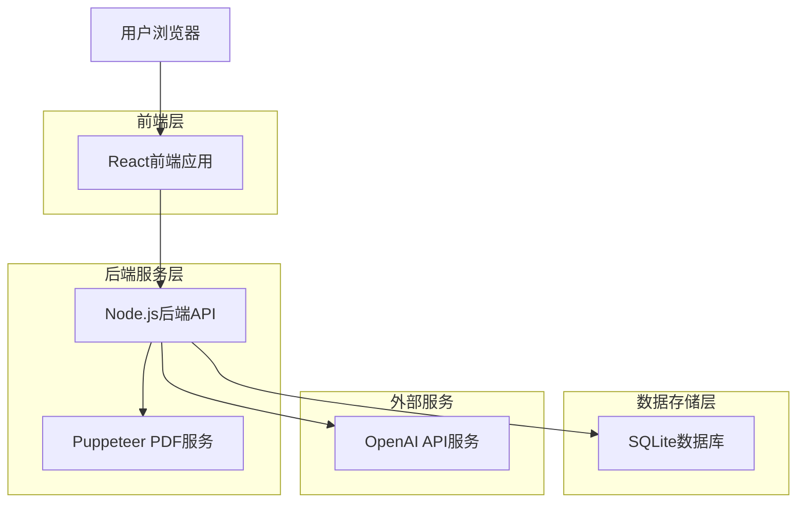
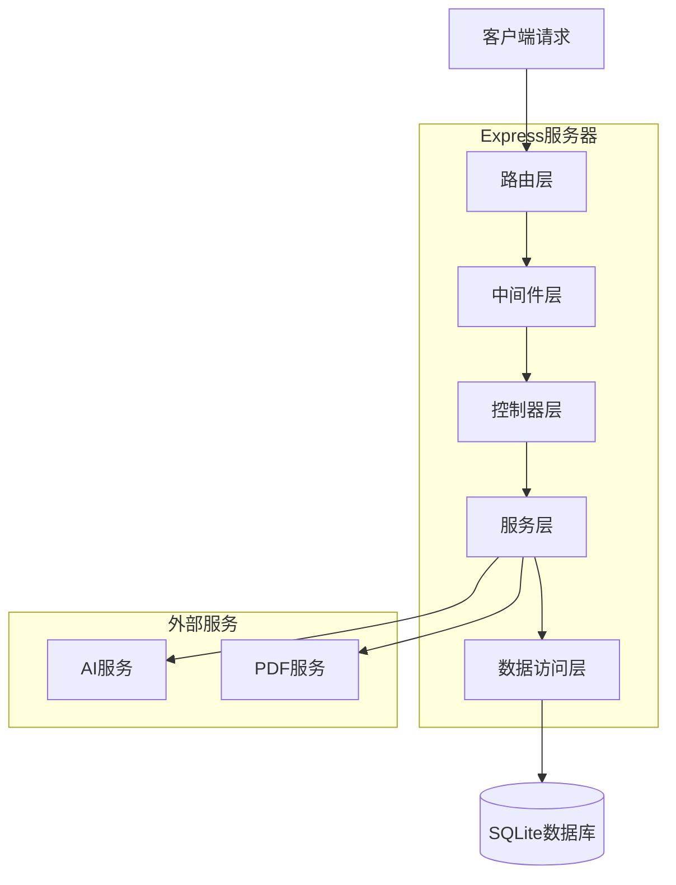
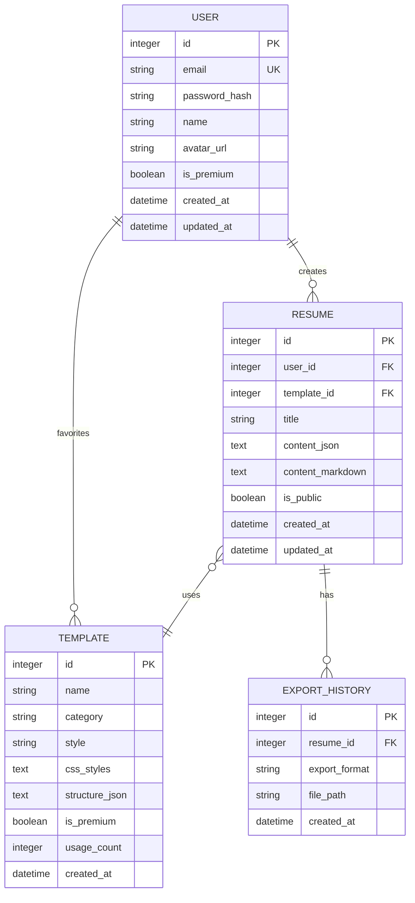

# AI简历生成平台技术架构文档

## 1. 架构设计



## 2. 技术描述

- **前端**: React@18 + JavaScript + Vite + TailwindCSS@3 + Zustand
- **初始化工具**: vite-init
- **后端**: Node.js@18 + Express@4 + JavaScript
- **数据库**: SQLite3 + Sequelize ORM
- **AI集成**: OpenAI SDK
- **PDF生成**: Puppeteer + react-to-print
- **Markdown处理**: react-markdown + remark-gfm

## 3. 路由定义

| 路由 | 用途 |
|------|------|
| / | 首页，展示产品和模板 |
| /editor/:id | 简历编辑器，支持新建和编辑 |
| /templates | 模板库页面 |
| /profile | 用户中心，管理简历和个人信息 |
| /login | 登录页面 |
| /register | 注册页面 |
| /preview/:id | 简历预览页面 |
| /export/:id | 导出页面，选择格式和下载 |

## 4. API定义

### 4.1 用户认证API

**用户注册**
```
POST /api/auth/register
```

请求参数：
| 参数名 | 类型 | 必填 | 描述 |
|--------|------|------|------|
| email | string | 是 | 用户邮箱 |
| password | string | 是 | 密码（6-20位） |
| name | string | 是 | 用户姓名 |

响应示例：
```json
{
  "success": true,
  "data": {
    "id": 1,
    "email": "user@example.com",
    "name": "张三",
    "token": "eyJhbGciOiJIUzI1NiIsInR5cCI6IkpXVCJ9..."
  }
}
```

**用户登录**
```
POST /api/auth/login
```

请求参数：
| 参数名 | 类型 | 必填 | 描述 |
|--------|------|------|------|
| email | string | 是 | 用户邮箱 |
| password | string | 是 | 密码 |

### 4.2 简历管理API

**创建简历**
```
POST /api/resumes
```

请求参数：
| 参数名 | 类型 | 必填 | 描述 |
|--------|------|------|------|
| title | string | 是 | 简历标题 |
| template_id | number | 否 | 模板ID |
| content | object | 是 | 简历内容JSON |

**获取简历列表**
```
GET /api/resumes
```

查询参数：
| 参数名 | 类型 | 必填 | 描述 |
|--------|------|------|------|
| page | number | 否 | 页码，默认1 |
| limit | number | 否 | 每页数量，默认10 |

**更新简历**
```
PUT /api/resumes/:id
```

**删除简历**
```
DELETE /api/resumes/:id
```

### 4.3 AI优化API

**内容优化**
```
POST /api/ai/optimize
```

请求参数：
| 参数名 | 类型 | 必填 | 描述 |
|--------|------|------|------|
| content | string | 是 | 需要优化的内容 |
| type | string | 是 | 内容类型：experience/project/skill |
| industry | string | 否 | 目标行业 |

**生成建议**
```
POST /api/ai/suggest
```

请求参数：
| 参数名 | 类型 | 必填 | 描述 |
|--------|------|------|------|
| prompt | string | 是 | 生成提示 |
| context | object | 否 | 上下文信息 |

### 4.4 模板管理API

**获取模板列表**
```
GET /api/templates
```

查询参数：
| 参数名 | 类型 | 必填 | 描述 |
|--------|------|------|------|
| category | string | 否 | 分类筛选 |
| style | string | 否 | 风格筛选 |

**获取模板详情**
```
GET /api/templates/:id
```

### 4.5 导出API

**导出PDF**
```
POST /api/export/pdf
```

请求参数：
| 参数名 | 类型 | 必填 | 描述 |
|--------|------|------|------|
| resume_id | number | 是 | 简历ID |
| template_id | number | 否 | 模板ID |
| format | string | 否 | 格式：a4/letter |

**导出Markdown**
```
POST /api/export/markdown
```

## 5. 服务器架构设计



## 6. 数据模型

### 6.1 数据库实体关系图



### 6.2 数据定义语言

**用户表 (users)**
```sql
CREATE TABLE users (
    id INTEGER PRIMARY KEY AUTOINCREMENT,
    email VARCHAR(255) UNIQUE NOT NULL,
    password_hash VARCHAR(255) NOT NULL,
    name VARCHAR(100) NOT NULL,
    avatar_url VARCHAR(500),
    is_premium BOOLEAN DEFAULT FALSE,
    created_at DATETIME DEFAULT CURRENT_TIMESTAMP,
    updated_at DATETIME DEFAULT CURRENT_TIMESTAMP
);

CREATE INDEX idx_users_email ON users(email);
```

**简历表 (resumes)**
```sql
CREATE TABLE resumes (
    id INTEGER PRIMARY KEY AUTOINCREMENT,
    user_id INTEGER NOT NULL,
    template_id INTEGER,
    title VARCHAR(200) NOT NULL,
    content_json TEXT NOT NULL,
    content_markdown TEXT,
    is_public BOOLEAN DEFAULT FALSE,
    created_at DATETIME DEFAULT CURRENT_TIMESTAMP,
    updated_at DATETIME DEFAULT CURRENT_TIMESTAMP,
    FOREIGN KEY (user_id) REFERENCES users(id),
    FOREIGN KEY (template_id) REFERENCES templates(id)
);

CREATE INDEX idx_resumes_user_id ON resumes(user_id);
CREATE INDEX idx_resumes_created_at ON resumes(created_at DESC);
```

**模板表 (templates)**
```sql
CREATE TABLE templates (
    id INTEGER PRIMARY KEY AUTOINCREMENT,
    name VARCHAR(100) NOT NULL,
    category VARCHAR(50) NOT NULL,
    style VARCHAR(50) NOT NULL,
    css_styles TEXT NOT NULL,
    structure_json TEXT NOT NULL,
    is_premium BOOLEAN DEFAULT FALSE,
    usage_count INTEGER DEFAULT 0,
    created_at DATETIME DEFAULT CURRENT_TIMESTAMP
);

CREATE INDEX idx_templates_category ON templates(category);
CREATE INDEX idx_templates_style ON templates(style);
```

**导出历史表 (export_history)**
```sql
CREATE TABLE export_history (
    id INTEGER PRIMARY KEY AUTOINCREMENT,
    resume_id INTEGER NOT NULL,
    export_format VARCHAR(20) NOT NULL,
    file_path VARCHAR(500) NOT NULL,
    created_at DATETIME DEFAULT CURRENT_TIMESTAMP,
    FOREIGN KEY (resume_id) REFERENCES resumes(id)
);

CREATE INDEX idx_export_history_resume_id ON export_history(resume_id);
```

## 7. 核心依赖包

### 7.1 前端依赖
```json
{
  "dependencies": {
    "react": "^18.2.0",
    "react-dom": "^18.2.0",
    "react-router-dom": "^6.8.0",
    "zustand": "^4.3.0",
    "react-markdown": "^8.0.0",
    "remark-gfm": "^3.0.0",
    "react-to-print": "^2.14.0",
    "axios": "^1.3.0",
    "tailwindcss": "^3.2.0"
  }
}
```

### 7.2 后端依赖
```json
{
  "dependencies": {
    "express": "^4.18.0",
    "cors": "^2.8.5",
    "dotenv": "^16.0.0",
    "sqlite3": "^5.1.0",
    "sequelize": "^6.28.0",
    "bcryptjs": "^2.4.3",
    "jsonwebtoken": "^9.0.0",
    "openai": "^3.1.0",
    "puppeteer": "^19.6.0",
    "multer": "^1.4.5",
    "helmet": "^6.0.0",
    "express-rate-limit": "^6.7.0"
  }
}
```

## 8. 部署建议

### 8.1 开发环境
- 前端：Vite开发服务器，端口3000
- 后端：Node.js开发服务器，端口3001
- 数据库：SQLite本地文件

### 8.2 生产环境
- 前端：静态文件部署到CDN
- 后端：PM2进程管理，Nginx反向代理
- 数据库：考虑迁移到PostgreSQL（用户量增长后）

### 8.3 环境变量配置
```
# 后端配置
PORT=3001
NODE_ENV=production
JWT_SECRET=your-secret-key
OPENAI_API_KEY=your-openai-key
DATABASE_URL=sqlite:./database.sqlite

# 前端配置
VITE_API_URL=http://your-api-domain.com
VITE_MAX_FILE_SIZE=5242880
```

## 9. 性能优化建议

### 9.1 前端优化
- 代码分割：按路由懒加载组件
- 图片优化：使用WebP格式，懒加载
- 缓存策略：API响应缓存，本地存储用户偏好

### 9.2 后端优化
- 数据库索引优化
- Redis缓存热点数据
- PDF生成异步处理
- API响应压缩

### 9.3 AI调用优化
- 请求队列管理
- 调用频率限制
- 结果缓存机制
- 降级策略（AI服务不可用时的备选方案）
